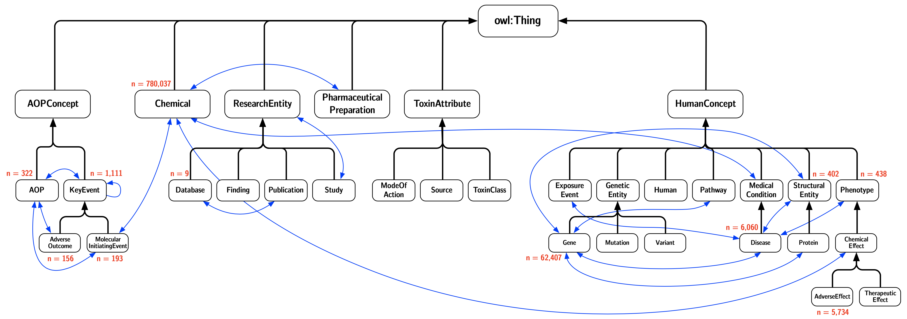

# `ComptoxAI`


A modern data infrastructure for computational toxicology.

- - -

ComptoxAI is a collection of resources made to enable a diverse range of artificial intelligence applications for computational toxicology data. This monorepo contains all of the code and data that comprises the overall ComptoxAI project, including code related to the database, website, REST API, graph machine learning toolkit, and other miscellaneous utilities.

ComptoxAI is maintained by [Joseph D. Romano, PhD](http://jdr.bio), who is a member of the [Computational Genetics Laboratory](http://epistasis.org) at the University of Pennsylvania, as well as a postdoctoral fellow in the [Center for Excellence in Environmental Toxicology](http://ceet.upenn.edu/). ComptoxAI is supported by grant funding from the US National Institutes of Health, including R01-LM010098 (PI: Jason Moore), R01-LM012601 (PI: Jason Moore), and T32-ES019851 (PI: Trevor Penning).

We welcome collaborations and contributions from third-party developers. Please refer to `CONTRIBUTING.md` for further information.

- - -

## Table of Contents
- [`ComptoxAI`](#comptoxai)
  - [Table of Contents](#table-of-contents)
  - [Main components of ComptoxAI](#main-components-of-comptoxai)
    - [Comptox Ontology](#comptox-ontology)
    - [ComptoxAI graph database](#comptoxai-graph-database)
    - [Adverse Outcome Pathway toolbox (PLANNED)](#adverse-outcome-pathway-toolbox-planned)
    - [Machine learning model library (PLANNED)](#machine-learning-model-library-planned)
    - [Web learning resources and interactive tools (PLANNED)](#web-learning-resources-and-interactive-tools-planned)
  - [Code Structure](#code-structure)
  - [Installing ComptoxAI](#installing-comptoxai)
      - [Installing using Conda](#installing-using-conda)
      - [Neo4j and plugins](#neo4j-and-plugins)
  - [Running tests](#running-tests)
  - [Planned features (an incomplete list)](#planned-features-an-incomplete-list)
  - [External data sources](#external-data-sources)
  - [Example Neo4j queries](#example-neo4j-queries)

- - -

## Main components of ComptoxAI

### Comptox Ontology


_(Counts may be out of date - refer to the graph database for up-to-date information)_

The Comptox Ontology provides a formal description of a wide array of conceptual entities involved in
computational toxicology. Specifically, it is meant to support translational research in computational
toxicology by defining and enumerating the relationships that occur between these entities.

Two ontologies are available for download:

- `comptox.rdf`: The core ontology, consisting of a class polyhierarchy and a definition of object/data
properties and their domains/ranges. This is also included in the root directory of this repository.

- `comptox_populated.rdf`: The same ontology, but populated with individuals for all currently supported classes. Since the file is very large (currently approaching 600 MB), it must be downloaded from an external server. The most recent version can be found at https://upenn.box.com/s/ti2abhdd1a6hdck5la35wre4k7foy21z.

`comptox.rdf` was created by manually building a class hierarchy and properties in the Protégé ontology editor.
`comptox_populated.rdf` was created by running the Python scripts in `comptox_ai/scripts/build/`, which parse
the core ontology, place individuals sourced from external data resources, attach data properties, and link
entities using object properties.

### ComptoxAI graph database

The graph database itself isn't distributed in flat files or database dumps. Instead, the full ontology file
(`comptox_populated.rdf`) is imported using the external library NSMNTX (fomally NeoSemantics), which
populates Neo4j databases with RDF triples.

### Adverse Outcome Pathway toolbox (PLANNED)

Adverse Outcome Pathways (AOPs) provide a conceptual framework for describing toxic exposures and the ways in
which they result in downstream effects. An AOP consists of a Molecular Initiating Event (MIE) and an Adverse
Outcome (AO), linked by one or more Key Events (KEs; MIEs happen to be a particular type of KE) organized as
a directed acyclic graph (DAG). Some important properties of AOPs:

- KEs can exist at different levels of organization (e.g., molecules, cells, tissues, organisms)
- MIEs, KEs, and AOs can be shared among multiple AOPs
- AOPs fit naturally into both the Comptox Ontology and ComptoxAI's graph database, since the ontology has
`AOP`, `KeyEvent`, `MolecularInitiatingEvent`, and `AdverseOutcome` classes that are populated in the database
using various external resources

### Machine learning model library (PLANNED)

One of the ultimate goals of ComptoxAI is to enable training advanced machine learning (ML) and deep learning
(DL) models that can identify patterns and lead to new discoveries from existing computational toxicology data.
A few of our areas of emphasis include:
- Graph convolutional neural networks (Graph CNNs)
- Transformations of the graph data that leverage heterogeneity of the multiple connected node types within
the database
- Autoencoder models to reduce dimensionality of computational toxicology data
- Pytorch and/or Tensorflow implementations of these models

### Web learning resources and interactive tools (PLANNED)

In the future, we hope to create interactive visualizations and discovery tools that make it easier for
toxicologists to interact with the data in ComptoxAI and the hypotheses that it enables.

- - -

## Code Structure

ComptoxAI is developed as a *monorepository*, meaning that all of its components (the graph database, website,
documentation, and other tools) are stored in a single location. This allows us to ensure that everything
functions as a single, cohesive data ecosystem, rather than a set of loosely connected tools.

Each major component can be found in the following locations:

- `comptox_ai/`: Code for building/interacting with the graph database (Python)
- `data/`: Auxiliary data files, including the unpopulated OWL ontology used to implement the graph database
- `docs/`: Documentation, including static website pages (Python / Sphinx)
- `scripts/`: Miscellaneous scripts and utility features
- `tests/`: Tests for the Python code (not yet implemented)
- `web/packages/api`: REST API implementation (Node.js / Express)
- `web/packages/app`: Interactive data portal web application (Node.js / React / Redux)

- - -

## Installing ComptoxAI

Eventually, ComptoxAI will be posted to the Python Package Index and made available for remote
installation with `pip`. For now, download the code (either through an official release on the
Releases page, or by cloning the entire repository) and install via:

`pip install /path/to/comptox_ai -r /path/to/comptox_ai/requirements.txt`

This should install ComptoxAI along with all required dependencies.

#### Installing using Conda

If you would like to install packages using their Conda distributions (when available), run the
following command **prior** to the `pip install` command that is shown above (from the root directory
of the project):

`conda install --file requirements-conda.txt`

Several package dependencies are not indexed by the Anaconda project, so those still need to be
installed via `pip` (or manually, if you're feeling especially sadistic).

#### Neo4j and plugins

You'll need to install Neo4j and several plugins to work with the graph database portion of ComptoxAI.
We recommend using [Neo4j Desktop](https://neo4j.com/download-center/#desktop) rather than manually
setting up the graph database server (the old preferred method), unless you are an expert.
However you choose to install Neo4j, perform the following steps once the database server is running:

1. (If using Neo4j desktop) Create a new project, with a name like "ComptoxAI"
2. Make sure security authorization is enabled, and set a username and password that you will remember
3. Access the configuration/settings file, and comment out the line that says `dbms.directories.import=import`
4. Install the required plugins (from the project's main detail page, if using Neo4j Desktop):
    - APOC
    - Graph Data Science Library
    - [Neosemantics (n10s)](https://github.com/neo4j-labs/neosemantics): make sure to modify the
	configuration/settings file as instructed
5. Restart Neo4j
6. Open the Neo4j browser (or a cypher shell, if you prefer)
7. Run the following two cypher commands to import the populated ontology:
    1. `CREATE CONSTRAINT n10s_unique_uri ON (r:Resource) ASSERT r.uri IS UNIQUE;`
    2. `CALL n10s.graphconfig.init();`
    3. `CALL n10s.rdf.import.fetch("file:///path/to/comptox_ai/data/comptox_populated.rdf", "RDF/XML");`

It should take a while for the entire database to import, but you will receive a response that
indicates the import was successful (or, possibly, unsuccessful).

- - -

<a name="tests"/>
## Running tests

Unit tests can be run using the following command, issued from the root directory of the source repository:

`pytest tests`

- - -

<a name="features"/>
## Planned features (an incomplete list)

- Simple import/export integration between Neo4j and OWL
- Support for feature vectors on ontology individuals (for graph machine learning applications)

- - -

<a name="sources"/>
## External data sources

When data types are defined multiple times below, I try to merge them in the best way possible.
At some point I will clearly enumerate the procedures used to merge equivalent data elements from
multiple sources.

- [Hetionet](het.io) (v1.0, with minor tweaks for compatibility reasons)
  - Adverse effects ('side effects' in hetionet)
  - Chemicals ('compounds' in hetionet)
  - Diseases
  - Genes
  - Phenotype ('symptom' in hetionet)
  - StructuralEntity ('anatomy' in hetionet)
- [CTD](ctdbase.org)
  - Chemicals
  - Pathways
  - Diseases
  - Exposure studies
  - Genes
  - Phenotypes (CTD considers GO terms to be phenotypes---this will have to be reconsidered)
- [TOXLINE](https://toxnet.nlm.nih.gov/newtoxnet/toxline.htm)
  - Toxicology literature, including exposure studies and chemical safety reports
- [TRI (Toxic Release Inventory)](https://toxnet.nlm.nih.gov/newtoxnet/tri.htm)
  - Records documenting environmental releases of toxic chemicals from US factories
- [DSSTox](https://comptox.epa.gov/dashboard)
  - Chemicals
  - Product/Use Categories (i.e., a utilitarian type of chemical classification)
  - Assay (labeled as "Assay/Gene" because genes are often the assay endpoint)


- - -

<a name="queries"/>
## Example Neo4j queries

We aim to keep adding Pythonic implementations of useful graph database queries.

Shortest path between a molecular initiating event and a resulting disease:
```
MATCH
	(d:ns0__Disease {ns0__commonName: 'Parkinsonian Disorders'}),
	(m:ns0__MolecularInitiatingEvent {ns0__xrefAOPWikiKEID: "Event:888"}),
	p=shortestPath((d)-[*]-(m))
WHERE length(p)>1
RETURN p;
```
