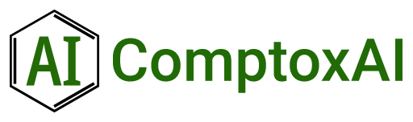

Introducing ComptoxAI
=====================

.. post:: Mar 3, 2020
   :tags: toxicology, comptoxai
   :category: ComptoxAI
   :author: Joseph D. Romano
   :location: Philadelphia, Philadelphia
   :nocomments:

We're thrilled to present ComptoxAI---a new resource that's meant to act as a
'home base' for advanced applications of artificial intelligence (AI) in the
field of computational toxicology! A complete set of :ref:`user guides
<user_guide>` and :ref:`documentation pages <api_docs>` are available on the main
site, but we're writing this post to give a brief introduction to ComptoxAI and
illustrate why it is important to the translational research community.

What exactly is computational toxicology?
-----------------------------------------

Computational toxicology (or 'comptox') is, broadly speaking, the application
of computers and mathematics to describing and predicting the adverse effects
that toxic chemicals have on the human body. The chemicals involved in
comptox research include environmental pollutants, naturally
occurring compounds, and intentionally engineered chemicals such as
pharmaceutical drugs.

Toxicology is an old field (on the scale of biomedical research), but
relatively little is known about *how* toxic exposures lead to adverse health
effects. This is exacerbated by the sheer number of chemicals in existance that
need to be studied for toxicological characteristics. The current standard for
evaluating toxicological risk involves arduous experimental research and
systematic reviews of prior research for individual chemicals. Not only is this
an expensive process (both time- and money-wise), but it is also unsustainable
for the hundreds of thousands---or even millions---of potentially toxic
chemicals that are of interest to researchers. One of the main aims of comptox
is to alleviate this issue by instead performing 'virtual screening' of
compounds to estimate which chemicals are **most likely** to be toxic (which
can then be followed up on by experimental toxicologists).

Why does AI matter for computational toxicology?
------------------------------------------------

The current 'state-of-the-art' in comptox is very similar to what it was 50
years ago. One of the most popular methods is QSAR (Quantitative
Structure-Activity Relationship) modeling, where researchers feed chemical
structure data for compounds with known toxicologic activity into a machine
learning model (usually something simple like logistic regression), and then
use the model to generate activity predictions for structural data on chemicals
with unknown activity. While this has been useful in some cases, modern
toxicologists largely agree that QSAR performance is pretty lacking.

AI has the potential to change this, as it has for many other fields over the
past decade or so. More complex AI and machine learning / deep learning models
have the structural capacity to not only incorporate information about chemical
properties and clinical outcomes, but also the myriad of translational
processes that occur in between (such as genetic factors, enzymatic and network
interactions, and tissue/organ functions). They also can incorporate other
important sources of knowledge, such as clinical trial outcomes, data from
similar chemicals, experimental assay results, and information extracted from
published research articles. Together, these types of data and knowledge can
paint a much more complete picture of important toxicological events than
structural data can alone.

What kinds of things can ComptoxAI do?
--------------------------------------

ComptoxAI can be split up into 5 major components:

1. A large graph database for storing and retrieving data relevant to comptox
2. A collection of graph algorithms for analyzing the contents and overall
   structure of the database
3. An OWL ontology used to structure and validate the graph database
4. This website, intended to serve as both documentation for ComptoxAI as well
   as as informational platform to teach and disseminate comptox concepts and
   research
5. A gallery of machine learning models designed to be used on ComptoxAI's
   database

At the time of writing this post, each of these have been developed to varying
degrees of completeness. We strongly encourage interested users to :ref:`get in
touch with us <contact>` to report bugs, request changes, or even just to ask
us questions about ComptoxAI and the work we do.

What kinds of things will ComptoxAI do eventually?
--------------------------------------------------

We have a lot of features in the works for ComptoxAI. This is why we refer to
it as a "toolchain" for comptox, rather than simply a database or a Python
package. Some of these planned features include:

- A public, hosted instance of the graph database, so users can interact with
  ComptoxAI without having to build the entire database on their local computer
- Improved options for query submission and knowledge retrieval from the graph
  database that don't require an intricate knowledge of web APIs or the Cypher
  query language
- Detailed blog posts for each new major feature, explaining what they are and
  why they are useful in an informal way
- Modules within the Python package dedicated to specific tasks in toxicology,
  such as automated prediction of Cramer classes, Thresholds of Toxicological
  Concern, and automated read-across for various applications
- More complete documentation, especially for graph algorithms and machine
  learning models
- Tutorials and other guides that are geared towards bench toxicologists and
  new informaticians, enabling them to run AI workflows on data relevant to
  specific questions that are important to their research